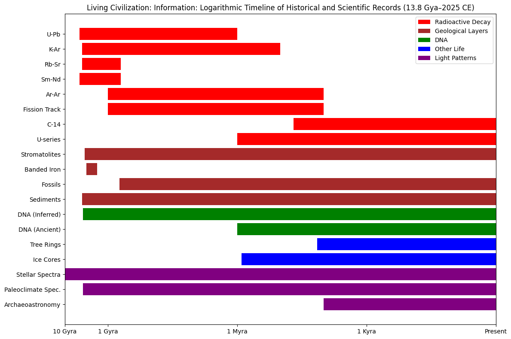

# Natural Provenance Systems

## Introduction

Space and Time, examined earlier as fundamental dimensions, do more than provide the stage for events. They are active recording mechanisms, creating the provenance substrate from which all coordination emerges.  Provenance did not begin with archives, ledgers, or institutions. It did not begin with writing, currency, or law. Provenance began the moment the universe started evolving in irreversible ways. From that point forward, every transformation left a trace—not by intention, but by necessity. Physical law itself generates records. Time does not merely pass; it inscribes.

Long before human observers learned to ask historical questions, the universe was already answering them. Physical processes that seem indifferent to record-keeping nevertheless produce attestation: verifiable evidence that something happened, when it happened relative to other events, and under what constraints. Provenance, in this sense, is not a social invention. It is a structural feature of reality.

Scientific inquiry is, at its core, the disciplined reading of these natural records. Each scientific field engages with a different recording medium, operating at different resolutions and over different temporal ranges. Together, they form an overlapping system that allows events separated by billions of years to be ordered, verified, and cross-checked. The records exist regardless of whether they are interpreted correctly—or interpreted at all.

These natural provenance systems share fundamental principles with those humanity later engineered deliberately. Both rely on irreversible processes. Both accumulate in layers. Both achieve reliability through independent verification mechanisms that validate one another. The parallels arise because both are constrained by the same underlying trade-offs between resolution, range, and reliability.

The universe produces provenance automatically, continuously, and indifferently. Observation does not create the record; it selects which record to read, at what resolution, and for what purpose. Where one system loses resolution, another maintains continuity. Where one reaches its temporal limit, another extends the range. The result is not a single authoritative record, but a resilient mesh of partially independent attestations. Provenance emerges from overlap, not singularity.

Before examining how observers choose among possible records, it is necessary to recognize the deeper fact: provenance is not something humanity invented to solve coordination problems. It is something humanity discovered while learning how the universe already solves the problem of time.

## I. Radioactive Decay: The Atomic Clock

Radioactive decay is the most literal form of natural provenance: a clock embedded in matter itself. Certain atomic nuclei are unstable and transform into other elements at fixed, statistically predictable rates. These decay rates are not influenced by temperature, pressure, chemical bonding, or environmental conditions. Once a radioactive isotope is incorporated into a mineral, a crystal lattice, or a biological system, the clock starts automatically and cannot be reset without physically altering the material. Time is recorded not symbolically, but materially, through irreversible atomic change.

Each radioactive system is defined by its half-life—the time required for half of the parent isotopes to decay into their daughter products. Half-lives range from thousands of years to billions, creating clocks tuned to very different temporal scales. By measuring the ratio between remaining parent atoms and accumulated daughter atoms, scientists can calculate how long the decay process has been running. This does not require knowing the absolute number of atoms at formation, only that the system has remained closed to gains or losses. The result is an attestable timestamp anchored not to human calendars, but to physical law.

At the longest timescales, uranium-lead (U-Pb) dating provides the backbone of deep-time chronology. Uranium isotopes decay through long chains into stable lead isotopes, with half-lives measured in billions of years. Certain minerals—most notably zircon—incorporate uranium when they crystallize but strongly reject lead, making them exceptionally clean clocks. U-Pb dating can reach back to the formation of the Earth itself, with usable resolution on the order of hundreds of thousands to a million years. The oldest known terrestrial materials, zircons from the Jack Hills of Western Australia, record ages of approximately 4.4 billion years, demonstrating that Earth's crust stabilized far earlier than once assumed and providing a concrete anchor for the earliest chapters of planetary history.

At intermediate scales, potassium-argon (K-Ar) and its refined variant argon-argon (Ar-Ar) dating fill the vast middle ground. Potassium-40 decays into argon-40, a noble gas that escapes molten rock but becomes trapped once the rock solidifies. This makes volcanic layers especially valuable provenance markers. Ash beds interleaved with sedimentary sequences act as timestamped horizons, allowing relative biological or archaeological sequences to be tied to absolute time. The dating of volcanic ash layers surrounding the fossils of _Australopithecus afarensis_ established the age of "Lucy" at approximately 3.2 million years—atomic decay providing temporal anchoring for evolutionary narratives without relying on fossil interpretation alone.

At the finest resolution, carbon-14 dating operates on the scale of human and late Ice Age history. Carbon-14 is continuously produced in the atmosphere and incorporated into living organisms. While alive, organisms maintain equilibrium with atmospheric carbon; when they die, that exchange stops, and radioactive decay begins. With a half-life of about 5,730 years, carbon-14 dating is effective out to roughly fifty thousand years, with resolutions measured in decades. Its limitation—that it only applies to once-living material—is also its strength: it provides high-resolution timestamps for organic artifacts, human remains, and ecological change precisely where other isotope systems lose sensitivity.

Beyond these well-known methods exists a broader constellation of radioactive clocks: rubidium-strontium, samarium-neodymium, fission-track dating, and many others. Each system has its own decay constants, optimal timescales, and material preferences. No single isotope system is sufficient on its own. Their power emerges from overlap. The same rock can often be dated using multiple decay schemes; when those independent clocks converge, confidence increases dramatically. When they diverge, the discrepancy reveals later disturbance, partial resetting, or previously unrecognized processes.

This is the defining feature of radioactive decay as provenance: it is not a single authoritative timestamp, but a mesh of partially independent clocks governed by the same physical laws. Reliability arises from redundancy, not from trust. The atoms do not agree with one another; they decay. Agreement emerges only when multiple unidirectional processes tell the same temporal story. Time becomes knowable not because it is declared, but because it is conserved in matter itself.

## II. Geological Layers: The Stratigraphic Record

If radioactive decay provides clocks, geological layers provide sequence. Across much of Earth's surface, material accumulates gradually: sediments settle out of water or air, compact, and lithify into rock. Each layer forms under specific environmental conditions and preserves a snapshot of those conditions at the moment of deposition. The fundamental ordering principle is simple and powerful—in undisturbed sequences, older layers lie beneath younger ones. This principle of superposition creates a naturally ordered record of events through time. While tectonic forces can later fold, fracture, or overturn strata, those disturbances themselves become part of the record, readable through structural relationships. Time, here, is preserved as order.

Sedimentary sequences function as one of the most continuous provenance systems on the planet. Rivers, lakes, deltas, and oceans have been depositing material for billions of years, often without interruption. Each layer carries multiple forms of information: grain size reflects energy and climate; mineral composition reflects source material and chemistry; fossils record the presence and evolution of life; isotopic and chemical signatures register atmospheric and oceanic conditions. Resolution varies widely. In some environments—such as glacial lakes or tidal flats—annual or even seasonal layers are preserved, creating records comparable in precision to tree rings. In others, particularly the deep ocean, individual layers may represent thousands or millions of years. Ice cores drilled from polar ice sheets capture an even longer high-resolution record: layers of annual snowfall compressed into ice preserve atmospheric composition, temperature proxies, and volcanic ash dating back 800,000 years in Antarctica. Each layer traps air bubbles—samples of ancient atmosphere—creating a direct archive of past climate conditions with resolution approaching annual precision for recent millennia. What stratigraphy sacrifices in temporal precision, it gains in contextual richness and continuity—the narrative of environmental change that dates alone cannot provide.

Some stratigraphic records capture not just gradual change, but planetary transformation. Banded iron formations, deposited primarily between roughly 3.8 and 1.8 billion years ago, record a fundamental shift in Earth's chemistry: the accumulation of free oxygen in the atmosphere and oceans. These alternating layers of iron-rich and silica-rich material are not biological fossils in the traditional sense, yet they preserve the global signature of biological activity—specifically, oxygen produced by early photosynthetic organisms. Similarly, stromatolites—layered structures built by microbial mats—encode biological activity directly into rock. Found in deposits dating back more than 3.5 billion years, and still forming in rare modern environments like Shark Bay in Australia, stromatolites demonstrate how living processes can generate long-lived, readable geological provenance.

Certain layers stand out as global markers—sudden, widespread, and unmistakable. Volcanic ash beds settle rapidly across vast regions, forming thin but laterally extensive horizons that appear simultaneously in many sedimentary basins. Impact layers record abrupt planetary-scale events: the iridium-rich boundary marking the end of the Cretaceous period, deposited by the Chicxulub asteroid impact 66 million years ago, appears as a distinctive clay layer worldwide. These marker horizons function as synchronization points within the stratigraphic record, allowing distant sequences to be aligned with confidence. When such layers are dated using radioactive decay methods, relative order is linked to absolute time. This cross-referencing transforms stacked layers into a calibrated chronology: the geologic time scale. Stratigraphy does not merely preserve history; it provides the ordered framework into which all other deep-time provenance records are placed.

### III. DNA and Life Records: The Molecular Archive

Biological systems generate provenance through two intertwined processes: replication and growth. Genetic information copies itself across generations, and in doing so accumulates change. Physical bodies grow incrementally, embedding environmental conditions into their structure as they develop. Neither process is designed to record history, yet both do so automatically. DNA mutates at approximately predictable rates as it replicates, while tissues accrete in patterns constrained by time, resources, and environment. Together, these mechanisms create a biological archive that spans extraordinary temporal ranges—from annual cycles recorded in living organisms to evolutionary histories stretching back billions of years.

In rare cases, this provenance survives in direct molecular form. Ancient DNA can be recovered from fossils under favorable conditions, providing an unmediated genetic record of past organisms. Preserved sequences have been extracted from Neanderthals, Denisovans, mammoths, and early modern humans, allowing individual lineages, population movements, and interbreeding events to be reconstructed with remarkable specificity. The discovery of the Denisovans themselves came not from skeletal analysis but from DNA recovered from a single finger bone, revealing an entire hominin population previously unknown to science. The limits of this record are imposed by chemistry: DNA degrades over time, fragmenting and eventually disappearing. Beyond roughly a million years—and even sooner in most environments—direct molecular evidence becomes sparse or impossible to recover. Where preservation permits, however, ancient DNA provides provenance of unparalleled resolution.

Beyond the reach of preserved molecules lies a deeper, inferred record: evolutionary history reconstructed through molecular clocks. By comparing the genomes of living organisms, scientists can infer ancestral relationships based on accumulated genetic differences. Mutations accrue over generations in statistically regular ways, allowing divergence times to be estimated when calibrated against independent timestamps from the fossil record or geological events. This approach extends biological provenance back to the origin of life itself. Conserved genes, such as those coding for ribosomal RNA, are found across all domains of life, revealing a shared ancestry that converges on a Last Universal Common Ancestor more than three billion years ago. Mitochondrial and chloroplast genomes preserve evidence of ancient endosymbiosis, recording the absorption of once-independent organisms into complex cells roughly two billion years in the past. At these depths, resolution is coarse—measured in tens of millions of years—but continuity is maintained.

At the opposite end of the biological timescale, growth-based records provide some of the finest temporal resolution found in nature. Tree rings form as woody plants add a layer of tissue each growing season, producing annual markers whose thickness reflects environmental conditions such as temperature, rainfall, and nutrient availability. In some cases, seasonal variations within a single year are preserved. By matching overlapping ring patterns across many specimens—a process called cross-dating—continuous chronologies can be extended far beyond the lifespan of any individual tree, reaching back over 14,000 years. Bristlecone pines, for example, provide records spanning thousands of years. These growth records not only document climate and ecological change; they also serve as calibration tools for other provenance systems, anchoring radiocarbon dating to known calendar years. Their limitation is range: they apply only to certain organisms in certain environments, and only over relatively recent time.

Fossils bridge the molecular and geological archives. Preserved remains, traces, and impressions of past life link biological evolution to stratigraphic context. In exceptional cases, fossils capture fine anatomical detail or even behavior; more commonly, they provide fragmentary but essential anchor points in time. Fossil assemblages establish the order in which forms appeared, diversified, and disappeared, while their positions within geological layers tie those events to broader environmental change. Fossils calibrate molecular clocks, constraining inferred divergence times, and supply morphological and ecological information that DNA alone cannot convey. Together with genetic and growth-based records, they form a layered biological provenance system—one that does not merely record that life existed, but how it changed, adapted, and persisted through deep time.

## IV. Light Patterns: Reading the Cosmic Record

Light itself is one of the universe's most expansive provenance mechanisms. Because light travels at a finite speed, every astronomical observation is also a historical observation. Distant stars and galaxies are seen not as they are now, but as they were when their light began its journey—millions or billions of years ago. Embedded in that light is detailed information: spectral lines reveal chemical composition—helium was first discovered in the Sun's spectrum decades before being found on Earth; intensity and wavelength indicate temperature and energy; Doppler shifts encode motion and expansion. The redshift of distant galaxies records the large-scale dynamics of the universe, demonstrating that space itself is stretching over time. In this way, light functions as a naturally distributed timestamp, carrying attestable records across vast distances without degradation of sequence.

At the deepest scale, the cosmic microwave background represents the earliest readable provenance available to observation. This faint radiation was released roughly 380,000 years after the Big Bang, when the universe cooled enough for atoms to form and light could travel freely for the first time. The CMB preserves a snapshot of the universe at that moment, encoding minute temperature fluctuations that later grew into galaxies, clusters, and cosmic structure. These patterns are not interpreted qualitatively; they are measured with extraordinary precision, constraining the universe's age, composition, and geometry to within fractions of a percent. Here, provenance operates at a cosmological scale: the universe attests to its own initial conditions through light that has been traveling uninterrupted for nearly its entire history.

Closer to human timescales, light also mediates the interface between natural and human-generated provenance. Ancient structures such as Stonehenge or Mayan pyramids, aligned with solstices, equinoxes, and stellar cycles, record the systematic observation of celestial regularities, embedding astronomical knowledge into architecture and landscape. At the same time, modern analysis of light interacting with matter—through spectroscopy of ice cores, corals, shells, and sediments—reveals past climates, atmospheric composition, and ocean temperatures. These light-based measurements cross-validate geological and biological records, linking cosmic, planetary, and human histories into a single temporal fabric. Across all scales, the principle remains consistent: light does not merely illuminate the present. It preserves the past, carrying the universe's own records forward until an observer chooses to read them.

## V. The Timeline Synthesis: Overlapping Records Across Deep Time

In April 2025, I opened a conversation with Grok on X and asked a single question: "Information has been stored in many ways by both nature and civilization. Talk to me about some of the ways we can find historical or scientific records recorded in our landscape, within life itself and within patterns of light."

Within thirty minutes, the conversation had explored radioactive decay, geological stratification, DNA mutation, tree rings, ice cores, and stellar spectra. We discussed resolution trade-offs, calibration methods, and cross-validation. By the end, I had working Python code that I could paste directly into Google Colab to generate a visualization of these systems across logarithmic time—from the Big Bang to the present day.

This is worth pausing on: a question asked, a synthesis reached, a visualization created—all in the time it takes to drink a cup of coffee. The power of digital intelligence doesn't replace understanding; it accelerates the path to it. The constraint is no longer access to synthesis tools but choice about which questions to pursue and how to verify the answers we find.

The resulting chart reveals what words alone struggle to convey: the sheer density of overlapping provenance mechanisms operating across thirteen point eight billion years of cosmic and planetary history.

At the deepest timescales, uranium-lead dating and stellar spectra reach back billions of years, anchoring the formation of Earth's crust and the universe's large-scale structure. As we move forward in time, other methods begin: potassium-argon dating fills the gap between deep planetary history and recent epochs; geological layers accumulate continuously, preserving environmental context that isotope ratios alone cannot provide. Molecular clocks track biological divergence across the entire span of life, from the Last Universal Common Ancestor to the present, while fossils provide the morphological anchor points that calibrate those inferences.

The chart's structure makes visible what the previous sections established conceptually: these systems do not operate in isolation. Where one method's range ends, another overlaps. Where resolution becomes too coarse for detail, a finer-grained system takes over. Radiocarbon dating provides precision where uranium-lead becomes impractical. Tree rings offer annual resolution where radiocarbon reaches its limit. Ice cores extend that high-resolution record further back, preserving atmospheric history layer by layer for hundreds of thousands of years.

The most striking feature is not individual range or resolution, but redundancy. Multiple independent systems can often be applied to the same event or object: volcanic ash dated by potassium-argon, its position constrained by stratigraphy, its climate effects recorded in tree rings and ice cores. A fossil's age estimated through molecular divergence, calibrated by its geological context, confirmed by radioactive isotopes in the surrounding rock. This is not belt-and-suspenders caution. It is how provenance achieves reliability without central authority—through convergent attestation from processes governed by different physical laws.

The logarithmic scale is essential to the visualization. Linear time would render recent millennia invisible while stretching ancient eons into useless expanse. Logarithmic compression allows the entire span to remain legible: cosmic microwave background at one end, tree rings and radiocarbon at the other, with all the intermediate systems arrayed between them. The scale itself encodes a truth about provenance: to capture both the origin of the universe and the growth of a bristlecone pine requires accepting that not all time is equally resolvable. Precision and range trade off. The universe offers no single method that does both.

What this chart demonstrates—and what the natural provenance systems collectively establish—is that recording is not optional for physical reality. The universe produces attestable records automatically, continuously, and indifferently. It does so through irreversible processes: decay that cannot be reversed, layers that cannot be undeposited, mutations that cannot be unwritten, light that cannot be recalled. These records exist whether observed or not, whether interpreted correctly or misunderstood, whether valued or ignored.

The coordination cost of natural provenance is zero at the moment of creation. Atoms decay without negotiation. Sediments settle without consensus. DNA mutates without intent. The work—and the cost—appears only when an observer chooses to read these records. That choice determines what becomes known, what remains obscure, and what shapes our understanding of time itself.

---
